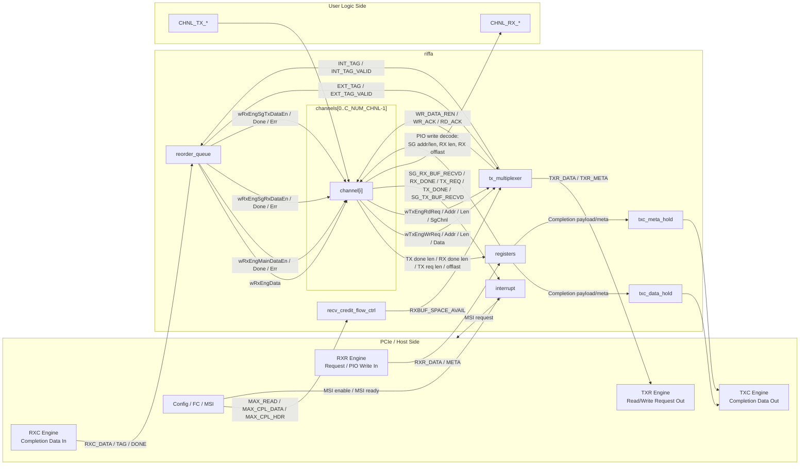
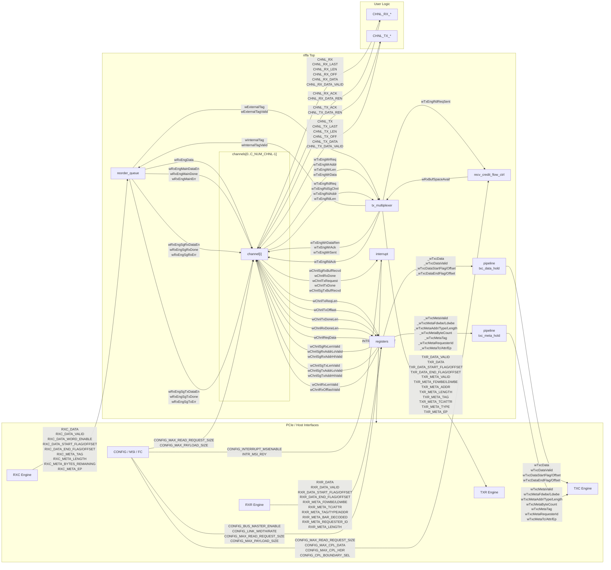
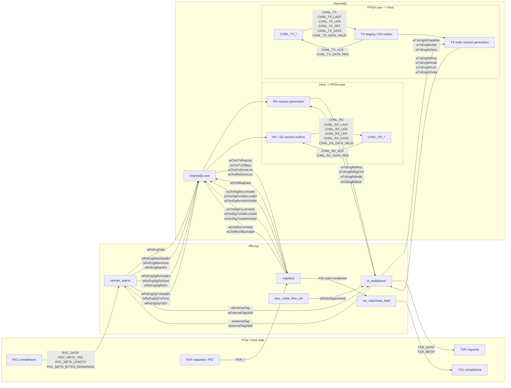
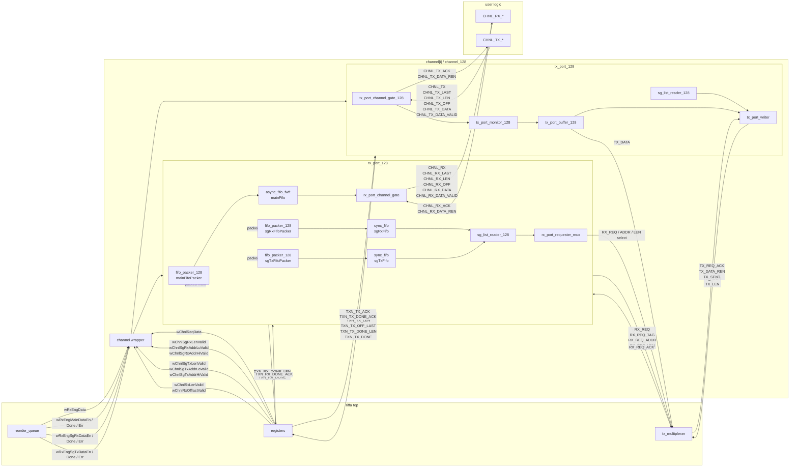
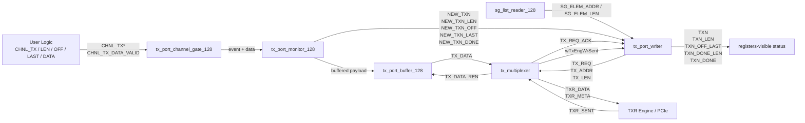
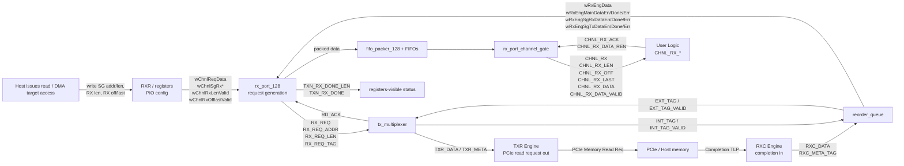
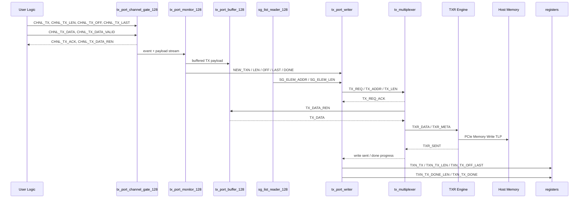
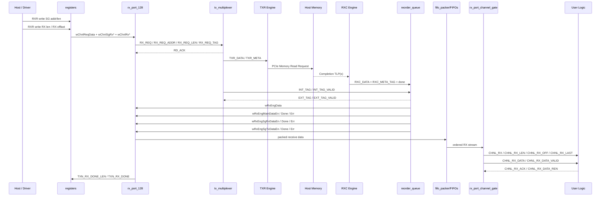

# 开源项目RIFFA_PCIE测试

https://github.com/KastnerRG/riffa

## **请根据riffa.v文件，画出所有模块及其子模块的连接关系**


按 `riffa.v` 顶层展开，模块连接关系可以画成下面这样。为了更贴近这份代码的默认参数，我按 `C_PCI_DATA_WIDTH = 128` 的实际展开路径来画；`32/64` 位时，`channel` 和 `tx_multiplexer` 只是切到对应宽度版本，结构是同一套壳子。

```text
riffa
├─ pipeline                txc_meta_hold
├─ pipeline                txc_data_hold
├─ reset_extender          reset_extender_inst
├─ reorder_queue           reorderQueue
│  ├─ ram_1clk_1w_1r       data RAMs (按 PCIe word 数生成多份)
│  ├─ ram_1clk_1w_1r       pktRam
│  ├─ ram_1clk_1w_1r       mapRam
│  ├─ reorder_queue_input  data_input
│  └─ reorder_queue_output data_output
├─ registers               reg_inst
│  ├─ pipeline             rxr_input_register
│  ├─ demux                field_demux
│  ├─ demux                tx_len_ready_demux
│  ├─ demux                tx_offlast_ready_demux
│  ├─ demux                rxdone_demux
│  ├─ demux                txdone_demux
│  ├─ demux                rx_len_demux
│  ├─ demux                rx_offlast_demux
│  ├─ demux                sgtx_addrhi_demux
│  ├─ demux                sgtx_addrlo_demux
│  ├─ demux                sgtxlen_demux
│  ├─ demux                sgrx_addrhi_demux
│  ├─ demux                sgrx_addrlo_demux
│  ├─ demux                sgrxlen_demux
│  ├─ pipeline             chnl_output_register
│  └─ pipeline             txc_output_register
├─ recv_credit_flow_ctrl   rc_fc
├─ interrupt               intr
│  └─ interrupt_controller intrCtlr
├─ tx_multiplexer          tx_mux_inst
│  ├─ fifo                 req_ack_fifo
│  └─ tx_multiplexer_128   tx_mux_128_inst
│     ├─ tx_engine_selector selRd
│     └─ tx_engine_selector selWr
└─ channels[0..C_NUM_CHNL-1]
   └─ channel
      └─ channel_128
         ├─ rx_port_128    rxPort
         │  ├─ fifo_packer_128      mainFifoPacker
         │  ├─ fifo_packer_128      sgRxFifoPacker
         │  ├─ fifo_packer_128      sgTxFifoPacker
         │  ├─ async_fifo_fwft      mainFifo
         │  ├─ sync_fifo            sgRxFifo
         │  ├─ sync_fifo            sgTxFifo
         │  ├─ rx_port_requester_mux requesterMux
         │  ├─ sg_list_reader_128   sgListReader
         │  └─ rx_port_channel_gate gate
         └─ tx_port_128    txPort
            ├─ tx_port_channel_gate_128 gate
            ├─ tx_port_monitor_128      monitor
            ├─ tx_port_buffer_128       buffer
            ├─ sg_list_reader_128       sgListReader
            └─ tx_port_writer           writer
```

关键数据通路可以再压缩成 4 条主线：

```text
1. RXC(Completion) -> reorder_queue -> channel[i].rx_port_128 -> CHNL_RX_*
2. RXR(Request/PIO) -> registers -> 
   a) 给 channel[i] 下发 SG/长度/offset 控制
   b) 生成 TXC_* 完成包
3. channel[i].tx_port_128 / rx_port_128 -> TX_REQ/RX_REQ -> tx_multiplexer -> TXR_*
4. channel 事件 -> interrupt -> interrupt_controller -> INTR_MSI_REQUEST
```

几个你最该看的定位点：

- 顶层实例化都在 [riffa.v](/Users/harry/Documents/vibe%20coding/riffa-master/fpga/riffa_hdl/riffa.v#L371) 到 [riffa.v](/Users/harry/Documents/vibe%20coding/riffa-master/fpga/riffa_hdl/riffa.v#L734)
- `reorder_queue` 子模块在 [reorder_queue.v](/Users/harry/Documents/vibe%20coding/riffa-master/fpga/riffa_hdl/reorder_queue.v#L202)
- `registers` 的 `pipeline/demux` 组在 [registers.v](/Users/harry/Documents/vibe%20coding/riffa-master/fpga/riffa_hdl/registers.v#L283)
- `tx_multiplexer -> tx_multiplexer_128` 在 [tx_multiplexer.v](/Users/harry/Documents/vibe%20coding/riffa-master/fpga/riffa_hdl/tx_multiplexer.v#L134) 和 [tx_multiplexer.v](/Users/harry/Documents/vibe%20coding/riffa-master/fpga/riffa_hdl/tx_multiplexer.v#L252)
- `channel -> channel_128` 在 [channel.v](/Users/harry/Documents/vibe%20coding/riffa-master/fpga/riffa_hdl/channel.v#L273)
- `channel_128` 的 `rxPort/txPort` 在 [channel_128.v](/Users/harry/Documents/vibe%20coding/riffa-master/fpga/riffa_hdl/channel_128.v#L150) 和 [channel_128.v](/Users/harry/Documents/vibe%20coding/riffa-master/fpga/riffa_hdl/channel_128.v#L217)
- `rx_port_128` 内部链路在 [rx_port_128.v](/Users/harry/Documents/vibe%20coding/riffa-master/fpga/riffa_hdl/rx_port_128.v#L201)
- `tx_port_128` 内部链路在 [tx_port_128.v](/Users/harry/Documents/vibe%20coding/riffa-master/fpga/riffa_hdl/tx_port_128.v#L132)

如果你愿意，我下一步可以直接把这张关系图整理成一份 Mermaid 流程图版本，方便你贴到 Markdown 里看。


## 请根据riffa.v画出这个模块的数据流图

下面按 `riffa.v` 顶层真实连线，整理成一张“数据流图”。这张图重点表现数据和控制信息在顶层模块间怎么流，不展开每个子模块内部细节。



可以把它理解成 4 条主数据路径：

1. `RXC -> reorder_queue -> channel`
   主机返回的 completion 数据先进入 `reorder_queue`，按 tag 重排后再送进各个 `channel`。

2. `RXR -> registers -> channel / TXC`
   主机发来的 PIO 读写请求先进入 `registers`。
   写请求用于给各通道下发 SG 地址、长度、offset 等控制信息。
   读请求则由 `registers` 组织成 completion，经 `txc_*_hold` 发到 `TXC`。

3. `channel -> tx_multiplexer -> TXR`
   各 `channel` 产生两类对主机的访问请求：
   - `wTxEngRdReq*`：向主机发起读请求
   - `wTxEngWrReq*`：向主机发起写请求  
   这些请求统一进入 `tx_multiplexer` 仲裁后，从 `TXR` 发出。

4. `channel <-> user logic`
   - `CHNL_RX_*`：RIFFA 把来自主机的数据送给用户逻辑
   - `CHNL_TX_*`：用户逻辑把待发送数据交给 RIFFA

如果你愿意，我下一步可以继续把这张图细化成一版“带信号名分层的数据流图”，把 `wRxEng* / wTxEng* / wChnl*` 这些总线全部标出来。

下面这版把 `riffa.v` 顶层里的关键总线名也标进去了，基本可以直接对照代码走信号。



可以把顶层理解成这几个“信号域”：

- `RXC -> reorder_queue -> channel`
  这是“主机读请求返回的数据”路径，信号前缀主要是 `RXC_*` 和 `wRxEng*`。

- `RXR -> registers -> channel/TXC`
  这是“PIO 配置与寄存器访问”路径，信号前缀主要是 `RXR_*`、`wChnl*`、`_wTxc*`。

- `channel -> tx_multiplexer -> TXR`
  这是“向主机发起读写请求”路径，信号前缀主要是 `wTxEngWr*`、`wTxEngRd*`、`TXR_*`。

- `channel <-> user logic`
  这是用户侧接口，信号前缀是 `CHNL_RX_*` 和 `CHNL_TX_*`。

如果你想，我可以再继续给你一版“只围绕 `channel[i]` 单通道”的细化数据流图，这样会更容易看清一个通道从 `RXR/RXC` 到 `CHNL_RX/CHNL_TX` 的完整闭环。

下面这版只围绕单个 `channel[i]`，把它在 `riffa.v` 顶层里的输入、输出和闭环关系单独拎出来了，便于看清一个通道是怎么工作的。



如果你把这个单通道闭环按行为理解，可以分成 3 段：

1. 接收路径
   `RXC -> reorder_queue -> channel[i] -> CHNL_RX_*`
   主机返回的数据经过重排后，落到该通道，再送给用户逻辑。

2. 发送路径
   `CHNL_TX_* -> channel[i] -> tx_multiplexer -> TXR`
   用户逻辑给通道喂数据，通道组织写请求，经仲裁后发到 PCIe。

3. 控制路径
   `RXR -> registers -> channel[i]`
   主机通过寄存器写入 SG 地址、传输长度、offset 等控制信息；
   通道再把完成长度、待发长度等状态回报给 `registers`，供主机读取。

如果你愿意，我还可以继续给你画最后一版：`channel[i]` 内部的 `rx_port_128 + tx_port_128` 细化图。这样就能把单通道内部也完全看清。


下面这版把 `channel[i]` 内部进一步展开到 `rx_port_128` 和 `tx_port_128`，对应你当前这套默认 128-bit 数据宽度实现。



这张图里最关键的内部逻辑是：

`rx_port_128`
- 负责把来自 `reorder_queue` 的三路数据流 `MAIN / SG_RX / SG_TX` 打包进 FIFO。
- `rx_port_requester_mux` 从主接收事务、SG_RX、SG_TX 三类请求里选一路，向 `tx_multiplexer` 发起 `RX_REQ`。
- `rx_port_channel_gate` 把主数据 FIFO 中的数据按事务边界送到 `CHNL_RX_*`。

`tx_port_128`
- 负责接收用户侧 `CHNL_TX_*` 数据。
- `tx_port_channel_gate_128` 先把用户事务和数据抓进来。
- `tx_port_monitor_128` 识别事务边界并统计接收长度。
- `tx_port_buffer_128` 缓冲真正要发到 PCIe 的数据。
- `sg_list_reader_128` 提供主机端目标地址/长度。
- `tx_port_writer` 按事务和 SG 描述符生成 `TX_REQ/TX_ADDR/TX_LEN`，驱动 `tx_multiplexer` 发包。

如果你愿意，我还可以把最后一版再收敛成“一个事务从 `CHNL_TX` 发到主机”或“一个事务从主机到 `CHNL_RX`”的时序/路径图。


下面我把两条最核心的“单事务路径”都画出来：

1. `CHNL_TX -> Host`：用户逻辑发数据到主机  
2. `Host -> CHNL_RX`：主机发数据到用户逻辑

这样你就能把前面的模块图和实际事务流对应起来。

**1. CHNL_TX -> Host 单事务路径**



这条路径的行为顺序可以理解成：

1. 用户侧从 `CHNL_TX_*` 把一笔发送事务送进 `tx_port_128`
2. `tx_port_channel_gate_128` 抓取事务边界和数据
3. `tx_port_monitor_128` 识别本次事务长度、offset、last，并把有效数据送进 `tx_port_buffer_128`
4. `sg_list_reader_128` 提供目标主机地址和长度
5. `tx_port_writer` 按 SG 描述符切分出一个或多个 `TX_REQ`
6. `tx_multiplexer` 对多个 channel 的请求做仲裁
7. 仲裁通过后，从 `tx_port_buffer_128` 取 `TX_DATA`，组包后经 `TXR` 发到 PCIe
8. 完成信息再回写到寄存器侧，供主机读取

---

**2. Host -> CHNL_RX 单事务路径**



这条路径的核心顺序是：

1. 主机先通过 `RXR -> registers` 写入接收事务参数
   - 主机内存地址
   - SG buffer 地址/长度
   - 事务长度
   - offset/last
2. `rx_port_128` 根据这些参数产生 `RX_REQ`
3. `tx_multiplexer` 仲裁后，从 `TXR` 发出 PCIe Memory Read Request
4. 主机返回 completion，进入 `RXC`
5. `reorder_queue` 按 tag 重排 completion 数据
6. 重排后的数据送回 `channel[i].rx_port_128`
7. `fifo_packer_128` 和 FIFO 把数据整理成连续流
8. `rx_port_channel_gate` 把事务化数据送到 `CHNL_RX_*`
9. 用户逻辑读取数据，通道再把完成长度回报给寄存器侧

---

**3. 两条路径的本质区别**

- `CHNL_TX -> Host`
  是 FPGA 主动把用户数据“写”到主机内存，核心是 `tx_port_writer`

- `Host -> CHNL_RX`
  是 FPGA 先向主机发起“读请求”，等 completion 回来后再交给用户逻辑，核心是 `rx_port_128 + reorder_queue`

如果你想，我下一步可以把这两张图再整理成一版 Mermaid `sequenceDiagram` 时序图，这样会比 flowchart 更像“握手时序”。


下面把这两条事务路径再整理成 `Mermaid sequenceDiagram` 时序图，读握手会更直观。

**1. `CHNL_TX -> Host` 时序图**



**2. `Host -> CHNL_RX` 时序图**



**3. 对照理解**

- 发方向：`User Logic -> tx_port_* -> tx_multiplexer -> TXR -> Host`
- 收方向：`Host -> RXC -> reorder_queue -> rx_port_* -> User Logic`
- 控制面：主机先经 `RXR -> registers` 配置事务参数，再由 channel 执行数据搬运

如果你愿意，我还能把这几张图整理成一份完整的 Markdown 文档，直接放进仓库里当设计说明。


## riffa.v这个模块有哪些需要关注的功能

`riffa.v` 这个顶层模块最值得关注的功能，基本可以分成 7 块来看：

1. `PCIe 接口汇聚与分发`
   它把四类 PCIe 侧接口统一接进来并分发出去：
   - `RXC`：主机返回的 completion 数据
   - `RXR`：主机发来的寄存器/PIO 请求
   - `TXC`：发给主机的 completion
   - `TXR`：发给主机的读写请求  
   这些接口定义集中在 [riffa.v](/Users/harry/Documents/vibe%20coding/riffa-master/fpga/riffa_hdl/riffa.v#L38)。

2. `读返回数据重排`
   `reorder_queue` 是这个模块里非常关键的一块。因为 FPGA 向主机发起多个 outstanding read 之后，completion 返回顺序可能乱序，所以这里负责：
   - 用 tag 跟踪请求
   - 把返回数据按正确顺序重排
   - 再送到对应 channel  
   实例化位置在 [riffa.v](/Users/harry/Documents/vibe%20coding/riffa-master/fpga/riffa_hdl/riffa.v#L440)。

3. `寄存器/控制面处理`
   `registers` 负责处理 `RXR` 进来的 PIO 访问，作用包括：
   - 主机给 channel 写 SG 地址、长度、offset 等控制信息
   - 主机读取 channel 完成长度、请求长度、核心配置等状态
   - 生成 `TXC` completion 返回给主机  
   这一块相当于 RIFFA 的“控制平面”，位置在 [riffa.v](/Users/harry/Documents/vibe%20coding/riffa-master/fpga/riffa_hdl/riffa.v#L483)。

4. `多通道数据搬运`
   顶层通过 `generate` 生成 `C_NUM_CHNL` 个 `channel`，每个 channel 都是一个独立的数据通道，负责：
   - Host -> FPGA 用户逻辑的数据接收
   - FPGA 用户逻辑 -> Host 的数据发送
   - 本通道的 SG、事务状态、用户侧握手  
   这是 RIFFA 的核心业务功能，位置在 [riffa.v](/Users/harry/Documents/vibe%20coding/riffa-master/fpga/riffa_hdl/riffa.v#L626)。

5. `发送请求仲裁`
   多个 channel 会同时产生两类请求：
   - 写主机内存请求 `wTxEngWr*`
   - 读主机内存请求 `wTxEngRd*`  
   `tx_multiplexer` 负责在这些请求之间仲裁，并统一从 `TXR` 发出去，同时处理 internal tag 和 external tag 的映射。位置在 [riffa.v](/Users/harry/Documents/vibe%20coding/riffa-master/fpga/riffa_hdl/riffa.v#L602)。

6. `流控与中断`
   顶层还负责两类系统功能：
   - `recv_credit_flow_ctrl`：跟踪 completion buffer credit，避免 read request 发过量
   - `interrupt`：汇总 channel 事件并发 MSI 中断  
   位置分别在 [riffa.v](/Users/harry/Documents/vibe%20coding/riffa-master/fpga/riffa_hdl/riffa.v#L554) 和 [riffa.v](/Users/harry/Documents/vibe%20coding/riffa-master/fpga/riffa_hdl/riffa.v#L571)。

7. `复位与发送路径保护`
   顶层用了两个 `pipeline` 做 `TXC` data/meta hold，再配合 `reset_extender`，目的是在复位过程中尽量保证 TX 路径稳定，尤其是核心状态读回和 RIFFA reset 的交互。相关逻辑在 [riffa.v](/Users/harry/Documents/vibe%20coding/riffa-master/fpga/riffa_hdl/riffa.v#L363) 到 [riffa.v](/Users/harry/Documents/vibe%20coding/riffa-master/fpga/riffa_hdl/riffa.v#L438)。

如果只从“读代码优先级”来说，我建议你先重点看这 4 个点：

- `reorder_queue`：理解 Host 读返回为什么需要重排
- `registers`：理解主机如何配置 channel
- `tx_multiplexer`：理解多个 channel 如何共用 TXR
- `channel`：理解真正的数据收发行为

如果你想，我可以下一步直接按“最值得读的 10 个信号”再帮你拆一遍 `riffa.v`。


**对于这些功能，请按照标准UVM框架，基于UVM 1.1d编写验证框架和测试用例，uvm源码位于verification/uvm_src，生成的文件请放置于verification文件夹内**


已在 `verification/` 下搭好一套 UVM 1.1d 验证骨架，核心文件是 [riffa_if.sv](/Users/harry/Documents/vibe%20coding/riffa-master/verification/riffa_if.sv)、[riffa_pkg.sv](/Users/harry/Documents/vibe%20coding/riffa-master/verification/riffa_pkg.sv)、[tb_riffa_top.sv](/Users/harry/Documents/vibe%20coding/riffa-master/verification/tb_riffa_top.sv)、[filelist.f](/Users/harry/Documents/vibe%20coding/riffa-master/verification/filelist.f) 和 [README.md](/Users/harry/Documents/vibe%20coding/riffa-master/verification/README.md)。

这套框架按 `riffa.v` 的关键功能拆了 interface、transaction、sequencer、driver、monitor、channel/host agent、scoreboard、coverage、env、virtual sequence 和 test。已经给了这些测试入口：
- `riffa_smoke_test`
- `riffa_reg_access_test`
- `riffa_dma_write_test`
- `riffa_dma_read_reorder_test`
- `riffa_interrupt_test`
- `riffa_flow_control_test`
- `riffa_reset_status_test`

需要说明的是，这是一套“可扩展的标准 UVM 骨架”，已经把 `RXC/RXR/TXC/TXR/Channel` 主路径和测试分层搭好了，但目前的 driver/scoreboard 还是 bring-up 级别，偏向结构验证和最小行为检查，还不是完整 PCIe 协议精确参考模型。我这次没有运行编译或仿真，因为当前环境里没有现成的仿真器流程可直接调用。若你愿意，我下一步可以继续把它补成“可直接跑”的版本，比如：
1. 继续细化 RXR/RXC driver 的协议时序
2. 加 channel/寄存器参考模型
3. 补 Makefile 或各仿真器启动脚本
4. 加 assertion 和功能覆盖点